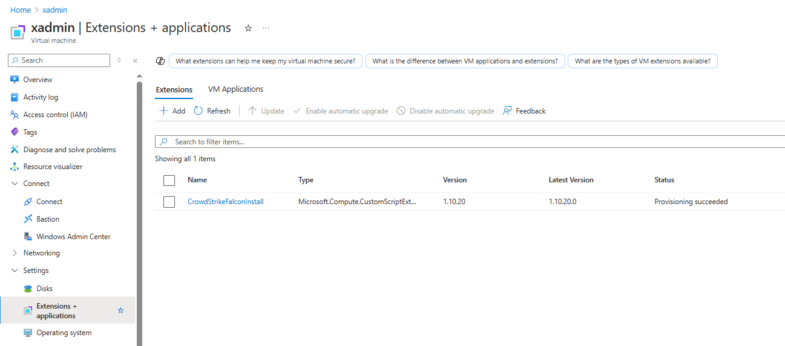
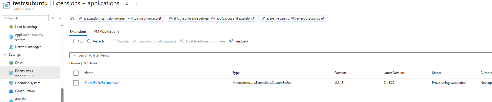
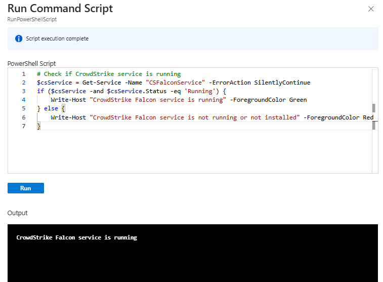

# Implantação do CrowdStrike Falcon por meio da Política do Azure (Windows e Linux)

Este modelo do Bicep implanta o agente CrowdStrike Falcon em máquinas virtuais Windows e Linux em todo o seu ambiente do Azure usando o Azure Policy e uma extensão de script personalizada. Esta solução é uma solução da comunidade que não é diretamente suportada pela Crowdstrike.

## Visão Geral

O modelo cria uma definição personalizada da Política do Azure que instala automaticamente o agente CrowdStrike Falcon em máquinas virtuais Windows e Linux. Ele opera no âmbito do grupo de gerenciamento ou da assinatura e cria todos os recursos necessários para a implantação, incluindo definições de política, atribuições e atribuições de funções.

## Pré-requisitos

- Assinatura do Azure ou acesso ao grupo de gerenciamento com permissões para criar políticas
- Credenciais da API do CrowdStrike Falcon (Client ID e Client Secret)
- ID do cliente CrowdStrike (CID)

Certifique-se de que os seguintes escopos da API estejam habilitados:

- Install:
  - **Host** [read]
  - **Installation Tokens** [read]
  - **Prevention policies** [read]
  - **Sensor Download** [read]
  - **Sensor update policies** [read]

## Parâmetros

| Parâmetro | Descrição | Default |
|-----------|-------------|---------|
| `policyAssignmentName` | Nome para a atribuição da política | `CS-Deploy-Falcon` |
| `policyDefinitionName` | Nome para a definição da política | `CS-Falcon-Windows` |
| `FalconCid` | ID do cliente CrowdStrike (CID) | (Obrigatório) |
| `installParams` | Parâmetros de instalação do agente Falcon | `/install /quiet /noreboot` |
| `policyEffect` | Efeito da aplicação da política | `DeployIfNotExists` |
| `location` | Região do Azure para recursos da política | (Obrigatório) |
| `FalconClientId` | ID do cliente da API CrowdStrike (seguro) | (Obrigatório) |
| `FalconClientSecret` | Segredo do cliente da API CrowdStrike (seguro) | (Obrigatório) |

## Implantação

### Política do Windows - Escopo do grupo de gerenciamento

[](https://portal.azure.com/#create/Microsoft.Template/uri/https%3A%2F%2Fraw.githubusercontent.com%2Fwellingtonvagetti%2Fcs-azure-falcon-policy-cse%2Fmain%2Fcs-windows.json/https%3A%2F%2Fraw.githubusercontent.com%2Fwellingtonvagetti%2Fcs-azure-falcon-policy-cse%2Fmain%2Fui.json)

### Política do Linux - Escopo do grupo de gerenciamento

[](https://portal.azure.com/#create/Microsoft.Template/uri/https%3A%2F%2Fraw.githubusercontent.com%2Fwellingtonvagetti%2Fcs-azure-falcon-policy-cse%2Fmain%2Fcs-linux.json/https%3A%2F%2Fraw.githubusercontent.com%2Fwellingtonvagetti%2Fcs-azure-falcon-policy-cse%2Fmain%2Fui.json)

### Política do Windows  - Escopo da assinatura

[](https://portal.azure.com/#create/Microsoft.Template/uri/https%3A%2F%2Fraw.githubusercontent.com%2Fwellingtonvagetti%2Fcs-azure-falcon-policy-cse%2Fmain%2Fcs-windows-subscription.json/https%3A%2F%2Fraw.githubusercontent.com%2Fwellingtonvagetti%2Fcs-azure-falcon-policy-cse%2Fmain%2Fui-subscription.json)

### Política do Linux  - Escopo da assinatura

[](https://portal.azure.com/#create/Microsoft.Template/uri/https%3A%2F%2Fraw.githubusercontent.com%2Fwellingtonvagetti%2Fcs-azure-falcon-policy-cse%2Fmain%2Fcs-linux-subscription.json/https%3A%2F%2Fraw.githubusercontent.com%2Fwellingtonvagetti%2Fcs-azure-falcon-policy-cse%2Fmain%2Fui-subscription.json)

### Azure CLI

```powershell
# Login to Azure
az login

# Implantar no escopo do grupo de gerenciamento
az deployment mg create \
  --name falcon-policy-deployment \
  --location eastus \
  --management-group-id YOUR_MGMT_GROUP_ID \
  --template-file cs-windows.bicep \
  --parameters FalconCid=YOUR_CID \
  --parameters FalconClientId=YOUR_CLIENT_ID \
  --parameters FalconClientSecret=YOUR_CLIENT_SECRET \
  --parameters location=eastus

# Implantar no escopo da assinatura
az deployment sub create \
  --name falcon-policy-deployment \
  --location eastus \
  --management-group-id YOUR_SUBSCRIPTION_ID \
  --template-file cs-windows-subscription.bicep \
  --parameters FalconCid=YOUR_CID \
  --parameters FalconClientId=YOUR_CLIENT_ID \
  --parameters FalconClientSecret=YOUR_CLIENT_SECRET \
  --parameters location=eastus
```

### Azure PowerShell

```powershell
# Login to Azure
Connect-AzAccount

# Deploy at subscription scope
New-AzDeployment -Name falcon-policy-deployment `
  -Location eastus `
  -TemplateFile .\cs-windows.bicep `
  -FalconCid YOUR_CID `
  -FalconClientId YOUR_CLIENT_ID `
  -FalconClientSecret YOUR_CLIENT_SECRET `
  -location eastus

# Deploy at management group scope
New-AzManagementGroupDeployment -Name falcon-policy-deployment `
  -Location eastus `
  -ManagementGroupId YOUR_MGMT_GROUP_ID `
  -TemplateFile .\cs-windows.bicep `
  -FalconCid YOUR_CID `
  -FalconClientId YOUR_CLIENT_ID `
  -FalconClientSecret YOUR_CLIENT_SECRET `
  -location eastus
```

## Como funciona

1. O modelo cria uma definição de política personalizada que identifica VMs Windows sem o agente Falcon instalado.
2. Em seguida, ele implanta uma extensão de script personalizada que baixa e instala o agente Falcon usando as credenciais fornecidas.
3. Uma identidade gerenciada é criada e recebe a função “Colaborador de máquina virtual” para permitir a implantação da extensão.
4. A política é atribuída à sua assinatura ou grupo de gerenciamento.

## Efeitos da política

- **DeployIfNotExists**: Instala automaticamente o agente em VMs não compatíveis (padrão)
- **AuditIfNotExists**: Relata VMs não compatíveis, mas não instala o agente
- **Disabled**: A política está inativa

## Resultado no Azure





## Verifique se o serviço está em execução (Running)

```powershell

# Check if CrowdStrike service is running
$csService = Get-Service -Name "CSFalconService" -ErrorAction SilentlyContinue
if ($csService -and $csService.Status -eq 'Running') {
    Write-Host "CrowdStrike Falcon service is running" -ForegroundColor Green
} else {
    Write-Host "CrowdStrike Falcon service is not running or not installed" -ForegroundColor Red
}
```



## Troubleshooting

Se a implantação falhar, verifique:

- Verifique se suas credenciais da API CrowdStrike são válidas
- Certifique-se de que a identidade gerenciada tenha as permissões adequadas
- Verifique os logs de implantação da extensão da VM para erros de instalação

## Observações

- O modelo usa o script de instalação oficial do CrowdStrike do GitHub
- As VMs recém-criadas receberão automaticamente o agente durante o provisionamento
- As credenciais são passadas com segurança para a implantação

## References

- [Documentação do CrowdStrike Falcon](https://falcon.crowdstrike.com/documentation/)
- [Documentação da Política do Azure](https://docs.microsoft.com/en-us/azure/governance/policy/)
- [Documentação do Bicep](https://docs.microsoft.com/en-us/azure/azure-resource-manager/bicep/)
